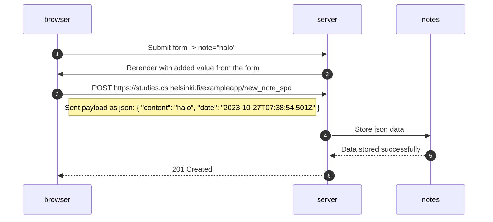

```mermaid
sequenceDiagram
autonumber
    participant browser
    participant server
    participant notes

    browser->>server: Submit form -> note="halo"
    server->>browser: Rerender with added value from the form

    browser->>server: POST https://studies.cs.helsinki.fi/exampleapp/new_note_spa
    activate server
    Note right of browser: Sent payload as json: { "content": "halo", "date": "2023-10-27T07:38:54.501Z" }

    server ->> notes: Store json data
    notes -->> server: Data stored successfully
    server -->> browser: 201 Created
```
